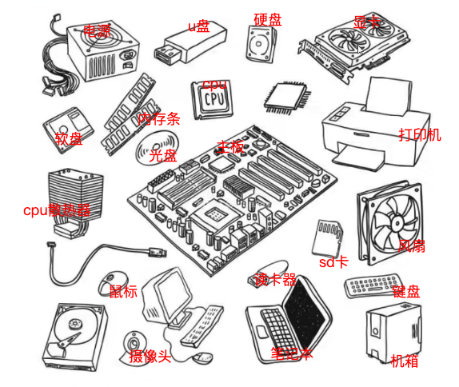
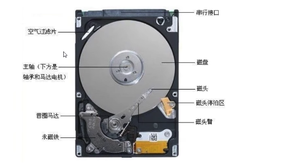
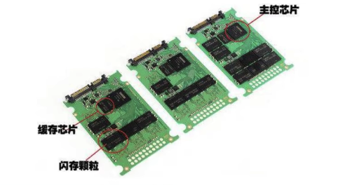
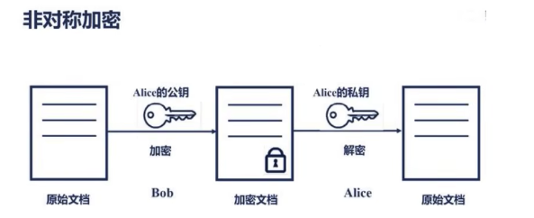

- {{renderer :tocgen,*,3,h}}
-
- [Linux-54Linux网络命令-相互免秘钥_哔哩哔哩_bilibili](https://www.bilibili.com/video/BV16Q4y1y7xS?p=54&vd_source=623bd6d17db3c63ea063661fc62f1ec6)
- {{video https://www.bilibili.com/video/BV16Q4y1y7xS?p=54&vd_source=623bd6d17db3c63ea063661fc62f1ec6}}
# 计算机硬件软件体系
	- ## 冯 诺依曼体系结构
		- 计算机处理的数据和指令一律用二进制数表示
		- 顺序执行程序
		- 计算机硬件由运算器、控制器、存储器、输入设备和输出设备五大部分组成
		- {:height 481, :width 573} 
	- ## 计算机硬件组成
		- 输入设备
			- 输入设备用来将人们人们熟悉的信息形式转换为机器能够识别的信息形式
				- 常见的有键盘，鼠标等
		- 输出设备
		  collapsed:: true
			- 输出设备可以将机器运算结果转换为人们熟悉的信息形式
			- 打印机输出，显示器输出等
		- 存储器
		  collapsed:: true
			- 存储器用来存放数据和程序
			- RAM(random access memory) 即随机存储 内存：
				- 速度快，容量小
				- 掉电易失
				- 逻辑IO
			- ROM(Read-Onboy memory) 即只读内存 硬盘：
				- 容量大，速度相对较慢
				- 长久保存
				- 物理IO
		- CPU（中央处理器）
			- 控制器
				- 控制器主要用来控制和指挥程序和数据的输入运行，以及处理运算结果
			- 运算器
				- 运算器主要运行算数运算和逻辑运算，并将中间结果暂存到运算器中
				- 
	- ## 硬盘的分类
		- 硬盘按照存储介质的不同可以分为如下两种
			- 机械硬盘
				- 机械硬盘采用磁性碟片来存储数据
				- 用显微镜把盘片放大，会看见盘片表面凹凸不平，凸起的地方被磁化，凹的地方是没有被磁化
				- 凸起的地方代表数字1（磁化为1），凹的地方代表数字0
				- 硬盘可以以二进制来存储表示文字、图片等信息。
				- 硬盘可以根据转速来判断硬盘的好坏 7200转/分 100-200M/s
				- 
				-
			- 固态硬盘（Solid State Disk,SSD)
			- 固态硬盘通过内存颗粒（固态电子存储芯片阵列）来存储数据
			- 
		- 读写速度的区别
			- 固态硬盘的读取速度普遍可以达到400M/s，写入速度也可以达到130M/s以上
			- 其读写速度是普通机械硬盘的3-5倍
		- 机械硬盘的数据读写
			- 主流的硬盘半机械半电子硬盘（机械硬盘）
				- 硬盘的转速（转速越快读取越快）
				- 寻道时间
				- 数据传输时间
				- 
	- ## 顺序读写与随机读写
	- ## 网络连接概念
		- IP地址IPADDR
			- IP地址是一种逻辑地址，用来标识网络中的一个个主机
				- IP地址=网络地址+主机地址
				- IP地址是一个4*8bit（1字节）由0/1组成的数字串（IP4协议）
		- 子网掩码NETMASK
			- 子网掩码只有一个功能，就是将IP地址分为网络地址和主机地址两部分
			- 子网掩码用来判断两台计算机的IP地址是否在同一子网中的根据
				- A 192.168.7.111 B192.168.8.222
				- 255.255.0.0
		- 默认网关GATEWAY
			- 连接不同的网络的设备都可以叫网关设备；网关的作用就是实现两个网络之间进行通信与控制
			- 网关地址就是网关设备的IP地址
		- 域名服务器DNS
			- DNS是域名服务器，用来解析域名的（域名和IP之间的解析）
			- 如果没有这东西，登录某个网站时就必须输入该网站的IP地址，有了DNS就可以直接输入网址
	- ## 网络连接模式
		- host-only（主机模式）
			- 在某些特殊的网络调试环境中要求真实环境和虚拟环境隔离开，这时你就可采用host-only模式
			- 在host-onboy模式中，所有的虚拟系统是可以相互通信的，但虚拟系统和真实的网络是被隔离开的。
			- 在host-onboy模式下，虚拟系统的TCP/IP配置信息都是由VMnet1(host-onboy)虚拟网络的DHCP服务器来动态分配的
		- bridged(桥接模式）
			- VMWare虚拟出来的操作系统就像是局域网中的一台独立的主机，它可以访问网内任何一台机器。
			- 使用桥接模式的虚拟系统和宿主机器的关系，就像连接在同一个Hub上的两台电脑。
			- 当前主机IP为192.168.8.100虚拟机192.168.8.xxx
				- 学习期间为了防止IP冲突，所以不选择这种模式
		- NAT(网络地址转换模式）
			- 使用NAT模式，就是让虚拟系统借助NAT(网络地址转换）功能，通过宿主机器所在的网络来访问公网。
			- NAT模式下的虚拟系统的TCP/IP配置信息是由VMnet8(NAT)虚拟网络的DHCP服务器提供的
			- 虚拟系统也就无法和本局域网中的其他真实主机进行通讯
			- 
	- ## 软件分类
		- 应用软件
			- 就是为了实现某些业务功能
			- 应用软件要基于对应的系统软件
				- 不同的操作系统要安装不同的软件
		- 系统软件
			- 就是为了和硬件打交道
			- 屏蔽应用软件与硬件的差异
		- 系统软件的分类
			- Windows
				- 用户量全球最大
				- 收费，不开源，民用较多
				- 各种软件比较齐全
			- Mac
				- 只限定于某些苹果的品牌机
				- iOS--自成一家
			- GNU/Linux
				- GNU是一个开源软件组织，认为世界上所有的软件都应该开源免费
					- GNU Is Not Unix
					- GCC++
					- 托瓦兹 林纳斯 Linus-- Linux（Linux Is Not Unix）
					- logo是企鹅
	- ## Linux分支
		- RedHat（收费）
			- CentOS
				- 完全开源免费
				- 不要使用最新版的CentOS
			- 主要用于服务器版本
			- 
		- Debain（免费）
			- Ubuntu
				- 视窗界面良好的Linux系统
				- 一些主流的软件都支持Ubuntu 系统
				- 
	- ## Linux下载
		- 
		- 官网
		  
		  [linux.org](https://linux.org)
			- 下载页面
			  
			    [linux.org](https://linux.org/pages/download/)
			- centos下载地址
			  
			    [Download](https://www.centos.org/download/)
# 虚拟机安装于配置
	- ## 虚拟化技术
		- 更好的利用计算机闲置的资源
		- 我们可以在计算机中虚拟出多台帮助我们执行程序或者业务
		- 虚拟机的各种组成理论上和真实主机是一样的
		- 如果要使用这种技术只需要安装对应的软件即可
			- Virtualbox
			- VirtualMachine
	- ## docker 配置CentOS环境
		- DONE docker配置CentOS环境
		- [[docker配置centos环境]]
# linux的命令
	- ## 命令学习法
		- Linux命令与参数之间必须用空格隔开
		- Linux命令是区分大小写的
		- 如果输入错误的命令
			- -bash: abcd: command not found
			- 命令敲错了
			- 命令未安装
		- type命令的类型（使用`type xxx`命令可以查看`xxx`命令的类型）
			- cd is a shell builtin
			- ping is /bin/ping
			- ll is aliased to `ls -l --color=auto'
			- for is a shell keyword
		- 命令的帮助文档
			- help（使用`help xxx`命令可以查看`xxx`命令的帮助）
				- 内置命令的帮助文档
			- man(`man xxx`命令可以查看`xxx`命令的帮助）
				- 外部命令的帮助文档
				- 因为当前系统是minnimal的，very basic 没有man包
				- 需要手动安装man
					- yum install man man-pages -y
				- 如果将来工作中遇到生疏的命令，直接百度
					- 如果不是为了装C，完全没有必要查看命令手册
	- ## 常用的命令
		- whereis 查询命令文件的位置
		- file 查看文件的类型
		- who 查看当前在线的用户
		- whoami 我是谁
		- pwd 我在哪
		- uname -a 查看内核信息
		- echo 类似于sout syso ,打印语句
		- clear 清屏
		- history 历史
	- ## 特殊字符
		- 点
			- 如果文件的开始是. 说明当前文件是一个隐藏文件
			- .指向当前目录
			- ..指向当前目录的上级目录
		- $
			- 说明这是一个变量
				- $PATH linux的环境变量
		- * 星号
			- 通配符
		- ~
			- 当前用户的家目录
			- 每个用户的家目录是不同的
			- root用户的家目录在系统跟目录下
			- 其他用户的家目录在 home/用户名 为家目录
		- 空格
			- Linux的命令与参数用空格隔开
		- /
			- 整个Linux的文件根目录
		- 命令的参数
			- 如果是单词一般加--
			- 如果是字母或缩写一般加-
# Linux的文件系统
	- ## 万事万物皆文件
		- 文件系统
			- 操作系统如何管理文件，内部定义了一些规则或者定义
		- 所以在Linux中的所有东西都是以文件的方式进行操作
		- 在Linux中，文件的访问和Windows的不一样，Windows依靠的是盘符进行访问
		- Linux维护者一个树状结构的文件模型
			- 只有一个根节点，它的名字叫做/
			- 一个节点上可以有多个子节点
		- 查找文件的方式
			- 相对路径
				- 以当前路径为基准点，查找其他资源
				- vi ../etc/sysconfig/network
			- 绝对路径
				- 以根目录为基准点，查找其他资源
				- vi /etc/sysconfig/network
			- 日常使用中，只要找到路径即可，但是如果是一些配置文件，尽量写绝对路径
		- 可以随意的挂载磁盘
		- ```Shell
		  mount /dev/disk1 /usr/dowload
		  disk1 1T
		  mount /dev/disk2 /usr/upload
		  disk2 100T
		  mount /dev/disk3 /usr/upload/photo
		  disk3 1P
		  
		  ```
	- ## Linux文件目录
		- 
		- bin(可执行文件）
			- bin是Binary的缩写，这个目录存放着最经常使用的命令
		- boot（引导分区）
			- 这里存放的是启动Linux时使用的一核心文件，包括一些连接文件以及镜像文件
		- dev（设备信息）
			- dev时Device（设备）的缩写，该目录下存放的是Linux的外部设备，在Linux中访问设备的方式和访问文件的方式是相同的
		- etc（配置文件目录）
			- 这个目录用来存放所有的系统管理所需要的配置文件和子目录
		- home（家目录）
			- 用户的主目录，在Linux中，每个用户都有一个自己的目录，一般该目录名是以账户的账号命名
		- lib（类库）
			- 这个目录存放着系统最基本的动态连接共享库，起作用类似于windows里的DLL文件。几乎所有的应用程序都需要用到这些共享库
		- lie64（类库）
		- media（多媒体）
			- Linux系统会自动识别一些设备，例如u盘、光驱等等，当识别后，Linux会把识别的设备挂在道这个目录下
		- mnt（一般默认挂在点）
			- 系统提供该目录是为了让用户临时挂载别的文件系统的，我们可以将光驱挂载在/mnt/上，然后进入该目录就可以查看光驱里的内容了
		- opt（应用软件安装目录）
			- 这是给主机额外安装软件所摆放的目录。比如安装一个ORACLE数据库就可以放到这个目录下。默认是空的
		- proc（进程信息）
			- 这个目录是一个虚拟的目录，他是系统内存的映射，我们可以通过方阿文这个目录来获取系统信息。
			- 这个目录的内容不在硬盘上而是在内存里，我们可以直接修改里面的某些文件，比如可以通过下面的命令来屏蔽主机的ping命令，是别人无法ping你的机器。
			  
			    ```Shell
			  echo 1 > /proc/sys/net/ipv4/icmp_echo_ignore_all
			  ```
		- root（root用户的家目录）
			- 该目录为系统管理员，也称作超级权限者的用户主目录
		- run（运行时的一些系统常量，系统变量）
			- 是一个临时文件系统，存储系统启动以来的信息。当系统重启时，这个目录下的文件应该被删掉或者清除。如果你的系统上有/var/run 目录，应该让他指向run
		- sbin（管理员可执行的命令）
			- s就是Super User的意思，这里存放的是系统管理员使用的系统管理程序
		- lost+found
			- 这个目录一般情况下是空的，当系统非法关机后，这里就存放了一些文件
		- src
			- 该目录存放一些服务启动后需要提取的数据
		- sys
			- 这是Linux2.6内核的一个很大的变化。该目录下安装了2.6内核中新出现的一个文件系统sysfs
			- sysfs文件系统集成了下面3种文件系统的信息：针对进程信息的proc文件系统、针对设备的devfs文件系统以及针对伪终端的devpts文件系统。该文件系统是内核设备树的一个直观反映。
			- 当一个内核对象被创建的时候，对应的文件和目录也在内核对象子系统中被创建。
		- temp
			- 这个目录是用来存放一些临时文件的
		- usr
			- 这是一个非常重要的目录，用户的很多应用程序和文件都放在这个目录下，类似于Windows下的program files目录
		- /usr/bin
			- 系统用户使用的应用程序
		- /usr/sbin
			- 超级用户使用的比较高级的管理程序和系统守护程序
		- /usr/src
			- 内核源代码默认的放置目录
		- /var
			- 这个目录存放着在不断扩充着的东西，我们习惯将那些经常被修改的目录放在这个目录下。包括各种日志文件
	- ## Linux的文件操作
		- cd
			- 改变当前工作目录
		- ls ll
			- 显示出指定目录下的所有文件
			- 文件的类型
				- -普通文件
				- d文件夹
				- l软连接
			- -rw-r--r--,root root 3384 Nov 11 23:51 install,log,syslog
		- mkdir
			- 创建文件目录
			- mkdir -p a/b/c/d/e/f会自动创建文件父目录
			- mkdir -p lucky/{1234}ls 一次可以创建多个子目录
		- rmdir
			- 删除空文件夹
			- 可以安全的删除文件目录
		- cp
			- 拷贝文件或者文件目录
			- cp 源文件 目标目录
				- cp abcd /opt
				- cp /opt/abcd ./
			- 拷贝文件夹
				- cp -r lucky /opt
				- 拷贝文件夹下所有的内容
		- mv
			- 移动文件或文件夹
				- mv a1 /opt
			- 修改文件名称
				- mv a abcd
		- rm
			- 删除文件
				- rm install.log
				- rm -f install.log（-f 为 强制删除）
			- 删除文件夹
				- rm -r abcd（-r 为 文件夹）
				- rm -rf abcd 谨慎使用，从删库到跑路
		- touch
			- 如果没有就创建一个文件
			- 如果该文件已经存在，修改文件的三个时间，将三个时间改为当前时间
		- stat
			- 查看文件的状态
			- lnode当前文件在文件系统的唯一标识，类似于ID
			- 时间
				- access 访问时间
				- modify 修改文件内容时间
				- change 修改文件元数据时间
					- 文件大小，文件所有者，文件权限
					- 对于文件的描述信息
		- ln
			- 创建文件的链接
			- 软（符号）连接
				- ln -s luck01 s1
				- 软连接和原始文件不是同一个文件
					- luck01 131085
					- s1 131073
			- 硬链接
				- ln luck02 hl
				- 硬链接和原始文件使用文件系统中的同一个文件
				- 如果害怕一个文件被别人误删，你可以使用硬链接保护这个文件
			- 软硬链接在链接文件的时候，推荐使用文件的绝对路径，否则可能出现问题
		- cat tac more less
			- cat
				- 将文件的内容输出到终端上，根据行号顺序输出
			- tac
				- 将文件的内容输出到终端上，根据行号反序输出
			- more less
				- 将文件将文件的内容输出到终端上，只输出屏幕大小
		- head
			- head -n luck01
				- 将luck01文件的前n行输出到终端上
		- tail
			- tail -n luck01
				- 将luck01文件的后n行输出到终端上
			- 读取新增数据
				- ping baidu,com >> baidu
				- tail -F baidu
				- 如果f
					- 它会监听指定inode的文件数据变化，但是当文件被删除后
					- 即使重新创建，inode也会发生变化，于是监听失败
				- 如果F
					- 它会监听指定名字的文件，如果文件被删除后，重新创建
					- 它会重新监听新文件的数据变化，监听不受影响
		- find
			- 查找指定的文件
			- find要查找的范围 -name 名字
			- find /etc -name profile
	- ## VI和VIM编辑器
		- 
	- ### 打开文件
		- 正常打开
			- vi profile
		- 打开问价，并将光标置于第8行
			- vi +8 profile
		- 打开最后一行
			- vi + profile
			- 按n查找下一个，按N查找上一个
		- 打开指定搜索单词的位置
		- vi +/if profile
	- ### 三种模式
		- 编辑（命令）模式
			- 编辑模式中，每一个按键都有其他的作用
		- 输入模式
			- 每一个按键按下什么，就向文本中输入什么
		- 末行（命令行）模式
			- 我们可以直接在VI中输入特定的命令
	- ### 三种模式切换
- 
- 编辑模式>输入模式
	- a 追加数据
	- i 在当前位置插入数据库
	- I 行首
	- A 行尾
	- o 在当前行后面开启一个新的输入行
	- O 在当前行上面开启一个新的输入行
- 输入模式>编辑模式
	- 按下esc
- 编辑模式>末行模式
	- 按下 ：
- 末行模式>编辑模式
	- 按下esc
### 编辑模式
- G 最后一行
- gg 跳转到第一行
- 数字gg 跳转到第数字行
- w 下个单词
- 数字w
- dw 删除一个单词
- 3dw 删除三个单词
- 3dd 删除三行
- u 回退到前面的操作（撤销）
- . 回退u执行的操作（取消撤销）
- yy 复制一行
- 3yy 复制三行
- p 粘贴
- 6p 粘贴6次
- x 剪切
- 3x 剪切3个字符
- r 替换，然后输入一个字符替换
- 3r 替换三个
### 输入模式

按啥是啥
### 末行模式
- w 保存
- q 退出
- ! 强制执行
- set nu 显示行号
- set nonu 取消行号
- wq 保存并退出
- q! 强制退出，但是不保存
- 如果上次异常退出会保留同名隐藏文件，每次启动会给予提示
	- 如果确认当前文件没问题，请删除隐藏文件
- /pattern
	- 搜索指定的字符串
	- /usr n向下查找 N逆向查找
- s/p1/p2/g
	- 替换字符串
	- g 替换当前行所有 否则只替换当前行第一个
		- s/abc/lucky/g
	- 查找指定行
		- 3,8s/abc/lucky/g
	- 替换全文
		- g/abc/s//lucky/g
## 计算机间的数据传输
### Windows- Linux
- lrzsz
	- 安装
		- yum install lrzsz -y
	- rz
		- 将文件从Windows上传到Linux
	- sz
		- 将文件从Linux传输到Windows
- xftp
	- 较为通用的文件传输方式
### Linux- Linux
- scp 源文件地址(source) 目标数据地址(target)
### 文件大小
- 分区信息
	- df -h
- 指定文件目录大小
	- du -h --max-depth=1 apache.tomcat-7.0.61
- swap
	- 一个特殊分区，以硬盘代替内存
	- 当内存使用满的时候，可以将一部分数据写到swap分区
## 文件压缩
### tar
- 主要针对的文件是lucky.tar.gz
- 解压缩
	- tar -zx(解压)v(过程)f(文件) lucky.tar.gz
- 压缩
	- tar -zc(压缩)f(文件) tomcat.tar.gz(压缩后的名字) aptche-tomcat-7.0.61(源文件)
	- tar zxf tomcat.tar.gz -C /opt/
		- -C 指定解压缩的文件目录
### zip和unzip
- 安装
	- yum install zip unzip -y
- 压缩
	- zip -r tomcat.zip apache-tomcat-7.0.61
- 解压缩
	- unzip tomcat.zip
# Linux的网络信息
## 主机名称
- 临时修改
	- hostname school
- 长久修改
	- vi /etc/hostname
## DNS解析
- 域名解析服务
- 可以将域名转换为IP地址
- DNS域名劫持
	- windows -→ C:\Windows\System32\drivers\etc\hosts
	- 123.56.138.186 www.baidu.com
- 修改主机域名
	- vi /etc/host
	- 将来我们需要把所有的虚拟机都配置hosts文件
	- 192.168.31.101 bd1601
## 网络相关命令
- ipconfig
	- 查看当前网卡的配置信息
	- 这个命令属于net-tools中的一个命令，但是在CentOS7的minimal版并没有集成这个包
	- 所以CentOS7的版本需要自己动手安装
	- 如果没有ifconfig，可以使用ip addr 临时代替
- netstat
	- 查看当前网络的状态信息
	- 一个机器默认有65536个端口号[0.65535]
	- 这是一个逻辑的概念，将来我么需要使用程序监听指定的端口，等待别人的访问
	- 一个端口只能被一个程序所监听，
	- *yum install -y net-tools*
	- netstat -anp
	- netstat -r 核心路由表 == route
- ping
	- 查看与目标IP地址能否连通
- telnet
	- 查看与目标IP的指定端口能否连通
	- yum install telnet -y
	- telnet 192.168.31.44 22
	-
- curl
	- restful风格，所有的资源在挖去拿网络上都有唯一的定位
	- 那么我们可以通过这个唯一定位标志指定的资源
	- curl -X GET http://www.baidu.com
## 防火墙
- 防火墙技术是通过邮寄结合各类用于安全管理与筛选的软件和硬件设备，帮助计算网络于其内、外网之间构建一道相对隔绝的保护屏障，以保护用户资料与信息安全性的一种技术
- 在centos7+中，使用firewalld代替以前的iptables；
- 
- 开启一个端口的正确操作
- 
## 加密算法
- ### 不可逆加密算法
- 
- 可以通过数据计算加密后的结果，但是通过结果无法计算出加密数据
- 应用场景
	- Hash算法常用在不可还原的密码存储、信息完整性校验
	- md5算法用于 文档、音视频文件、软件安装包等用新老摘要对比是否一样（接受到的文件是否被修改）
	- 用户名或者密码加密后数据库存储（数据库大多数不会存储关键信息的明文，就像很多登录功能的忘记密码不能找回，只能重置）
- ### 对称加密算法
- 
- Sysmetric Key Encryption
- 代表性算法叫做 DES、3DES、Blowfish、IDEA、RC4、RC5、RC6和AES
- 特点
	- 几十米和解密使用相同的密钥
- 优点
	- 生成密钥的算法公开、计算量小、加密速度快、加密效率高、密钥较短
- 缺点
	- 双方共同的密钥，有一方密钥被窃取，双方都影响
	- 如果为每个客户都生成不同的密钥，则密钥数量巨大，密钥管理有压力
- 应用场景
	- 登录信息用户名和密码加密、传输加密、指令加密
- ### 非对称算法
- 
- Asymmetric Key Encryption
- 非对称加密算法需要一对密钥（两个密钥）：
	- 公开密钥（publickey）和私有密钥（privatekey）（简称公钥、私钥）
	- 公开密钥和私有密钥生成时是一对
	- 用公钥加密只能是对应的私钥解密，同理用私钥加密只能用对应的公钥解密
- 代表性算法叫做 RSA、ECC、Diffie- Hellman、EI Gamal、DSA（数字签名用）
- 优点
	- 安全性高（几乎很难破解）
- 缺点
	- 加解密相对速度慢、密钥长、计算量大、效率低
- 应用场景
	- HTTP（ssl）证书里制作、CRS请求证书、金融通信加密、蓝牙等硬件信息加密配对传输、关键的登录信息验证。
## 主机间相互免密钥
- 可以通过ssh命令免密钥链接到其他的主机
- 如果是第一次简历连接，需要输入yes
	- 在~/.ssh/known_hosts文件记录了以前访问地址（ip hostname）的信息
	- 在访问地址的时候如果没有收录到known_hosts文件中，就需要输入yes
	- 如果以前收录到known_hosts文件中，直接输入密码即可
- 需要输入密码
	- 生成密钥
		- ssh-keygen -t rsa -P '' -f ~/.ssh/id_rsa
		- 
	- 如果想密钥登录哪台主机，只需要把自己的公钥传递给对方主机
	- 这个密钥要放在 ~/.ssh/authorized_keys
		- ssh-copy-id -i ~/.ssh/id_rsa.pub root@192.168.188.101
		- 
- 相互免密钥工作流程
- ## 主机名与Host校验
- 
- 错误原因
- Cannot determine realm for numeric host
- 解决方案1--本次
	- ssh -v -O GSSAPIAuthentication=no root@192.168.188.101
- 解决方案2--所有
	- 修改/etc/ssh/ssh_config文件的配置，以后则不会再出现此问题
	- 在最后添加
	- StricHostKeyChecking no
	  UserKnownHostFile /dev/null
# 日期与时间
## 时间命令
- date
- 修改时间
	- date -s 11:11:11
	- date -s 2022-11-11
	- date -s 2022-11-11 11:11:11
## 时间自动同步
- 自动同步时间
	- yum install ntp -y
	- ntpdate cn.ntp.org.cn
- 在CentOS8.0中默认不再支持ntp软件包，时间同步将由chrony来实现
	- dnf install chrony -y
	- 手动同步时间
	  
	    ```Shell
	  sh-4.4# chronyd -q 'server ntp.ntsc.ac.cn iburst'
	  2022-11-10T08:39:11Z chronyd version 4.1 starting (+CMDMON +NTP +REFCLOCK +RTC +PRIVDROP +SCFILTER +SIGND +ASYNCDNS +NTS +SECHASH +IPV6 +DEBUG)
	  2022-11-10T08:39:15Z System clock wrong by 0.222304 seconds (step)
	  2022-11-10T08:39:15Z chronyd exiting
	  sh-4.4# 
	  ```
	- 更好的方式是让chronyd后台运行，自动同步时间：
	  
	    ```Plain Text
	  systemctl enable chronyd
	  systemctl start chronyd
	  ```
	  
	  
	    **注意**：chronyd服务启动后，不能再用chronyd方式手动同步时间，会报“Fatal error : Another chronyd may already be running”的错误。
- ## 命令执行时间统计
  
  ```Shell
  #!/bin/bash
  start=$(date +%s)
  nmap man.linuxde.net $> /dev/null
  end=$(date+%s)
  difference=$((end-start))
  echo $difference seconds .
  
  ```
# 用户-组-权限
## 用户
- 新增用户
	- useradd luckyboy
	- 会创建同名的组和家目录
- 设置密码
	- passwd luckyboy
- 删除用户
	- userdel -r luckyboy
	- 级联删除家目录和组
- 修改用户信息
	- usermod -l luckyss luckyls 修改用户名
		- 家目录和组名称是不会修改的
	- usermod -L luckyss 锁定用户名
	- usermod -U luckyss 解锁用户名
- 常用文件
	- cat /etc/shadow
		- 用户名和密码
	- cat /etc/passwd
		- 用户名，编号，组编号，家目录，命令，目录
		- 6.5系统0-499 普通500+
		- 7.6系统0-999 普通1000+
- 切换账户
	- su luckboy
## 组
- 创建组
	- groupadd lucky
- 删除组
	- groupdel lucky
- 修改组名字
	- groupmod -n school lucky
- 查看当前用户对应的组
	- groups
	- groups schoolboy
		- 当我们创建用户的时候，会默认创建一个同名的主组
- 修改用户的组
	- usermod -g lucky schoolboy（主组）
	- usermod -G lucky schools（附属组）
- ## 权限
- 
- 查看文件的权限
	- -rw-r--r--,root root 3384 Nov 11 23:51 install,log,syslog
	- 三组权限，每组三个字母
		- r：读取权限
		- w：写入权限
		- x：执行权限
		- -：没有权限
	- root:所属用户（属主）
	- root:所属的组（属组）
- 权限的UGO模型
	- 权限
	- 属主的权限：属组的权限：其他的权限
	- 修改文件的权限可以从rwx和ugo两个方面进行修改
- 修改文件的权限
	- 修改文件所属
		- chown n1 /var/lucky1
		- chown n1:m1 /var/lucky2
		- 修改文件夹时，让子目录迭代修改
			- chown -R n1:m1 school
		- chgrp m2 lucky3
			- 当用户的组被修改之后，需要重新登录才能获取新组的权限
	- 修改文件的rwx
		- chmod o+w lucky4
		- chmod ug+rw lucky4
		- chmod ugo+rw lucky4
		- （权限RWX分别对应数字4 2 1 5=4+0+1 r-w)
			- chmod 664 lucky4    -→ (rw-rw-r)
			- 
# 管道与重定向
# 管道
- 将前面命令的结果作为参数传递给后面的命令
- grep
	- 强大的文本搜索工具
	- cat profile | grep if
	- ls / |grep ^t
## 重定向
- 改变数据传输的位置，方向
- 0 in 1 out 2 err
	- ls / 1 > lucky 标准输出
	- ls / > 标准输出
	- ls abcd 2 > lucky 错误输出
- `> 替换 >> 追加`
	- ls / 1 >> lucky
	- ls / 1 > lucky
- 结合使用
	- ls /etc/abc > lucky 2 >&1
	- ls /etc/abc >> lucky 2 >&1
- 信息黑洞
	- ls /etc/abc >> /dev/null 2>&1
# Linux的系统进程
## 进程信息
- ps -ef
	- UID PID PPID C STIME TTY        TIME CMD
	- UID 所属用户
	- PID 当前进程编号
	- PPID 当前进程编号的父进程编号
- ps -ef | grep redis
- ps -aux
	- 所有信息
- ps -aux --sort -pcpu
- top
- 当前服务器内存使用率
## 后台进程
- 只需要在命令的后面添加一个&符号
	- ing www.baidu,com >>baidu &
- jobs -l
	- 可以查看当前的后台进程
	- 只有当前用户界面可以获取到
- nohup 可以防止后台进程被挂起
	- nohup ping baidu.com >> baidu 2>&1 &
## 杀死进程
- kill -9 17599