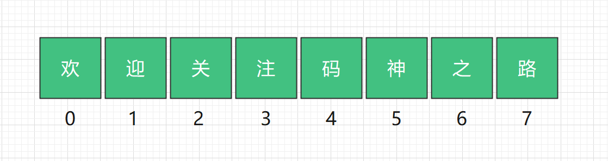
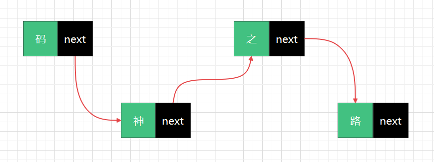
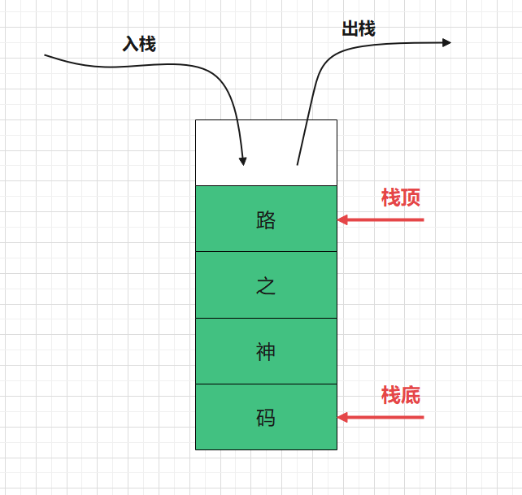
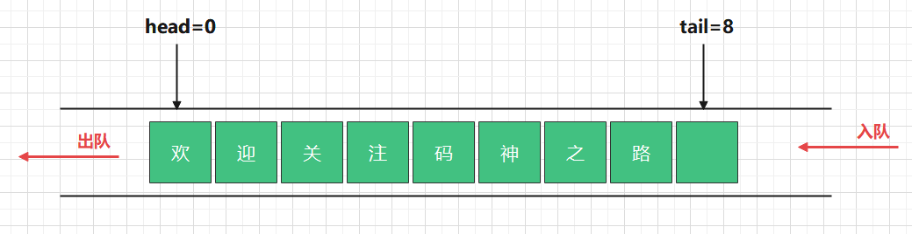
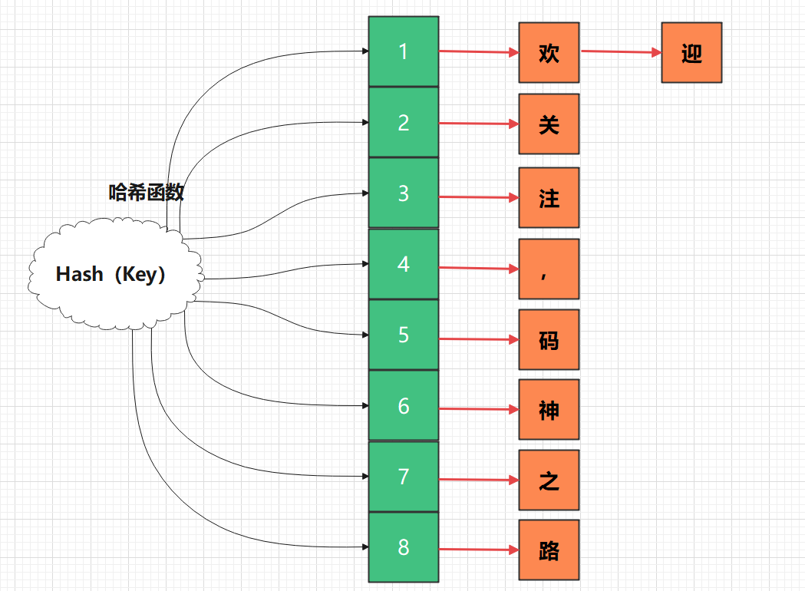
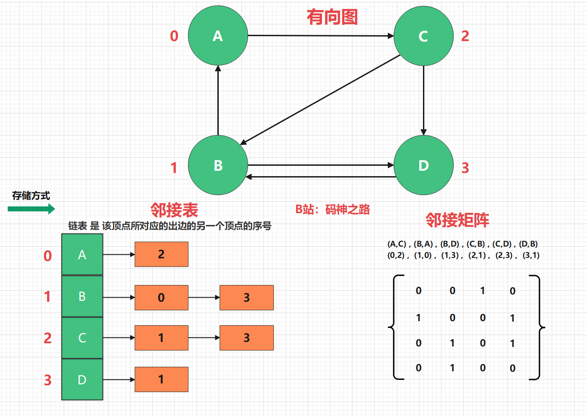

-
	- # 数组
		- > `数组`是一组`连续内存空间`存储的具有`相同类型`的数据，是一种`线性结构`。
		- 
		- 优势是什么？
			- `类型固定`:意味着长度固定
			- `连续内存空间`
			- 因为上述两点特性，基于初始地址，可以计算数组任意位置的内存地址，所谓的`查询快`。
			- `随机读取`：通过下标直接访问，即访问第N个元素，不需要访问前(N-1)个数据。
			- `顺序存储`：在内存中按顺序存放
			- 劣势是什么?
			- 数据初始化需要连续的内存空间，数据在内存当中是随机存放的，不一定有指定长度的连续空间
			- 当插入数据的时候，为了保持连续性，需要做数据迁移（想想如果，添加一个数据，需要向后移动一位，但是如果这一位被其他数据占用了，那么整个数组都需要进行迁移，找到能存放下的内存空间）
			- 同样的道理，删除的时候，也需要做数据迁移
			- 注意事项：尽量在数据初始化的时候，就确定其大小，数组适合读多的场景
		- ## 创建和使用
			- ```Go
			  
			  ```
	- # 链表
		- > 链表是一种`非连续`、`非顺序`的存储结构，由一系列节点组成，节点通过`指针完成了串联`，每个节点包含`数据`和`下一个节点指针`两部分。
		- 
		- 根据指针的方向可以分为：
			- 单向链表
			- 循环链表
			- 双向链表
			- 双向循环链表
		- 优势是什么？
			- 不需要连续空间
			- `随机存储`：非顺序存储
			- 插入，删除时，只需要更改指针指向即可，开销小
		- 劣势是什么？
			- 每个节点除了存储数据，还存储指针，占用额外的空间
			- `顺序存取`：存取第N个数据时，必须先访问前(N-1)个数据，效率低
		- 链表适合写多的场景
	- # 栈
		- > 又名`堆栈`，限定仅在`表尾进行插入和删除`操作的`线性表`（把所有数据用一根线儿串起来，再存储到物理空间中）。
		- 上面成为`栈顶`，下面称为`栈底`。
		- 向栈插入新元素称为`入栈`，新元素放到栈顶；从一个栈删除元素又称作`出栈`，它是把栈顶元素删除掉，使其下面相邻的元素成为新的栈顶元素。
		- 
		- 根据底层数据不同，可以分为：
			- `数组实现的顺序栈`
			- `链表实现的链式栈`
		- 优势是什么？
			- 先进后出，后进先出
			- 只能操作栈顶元素，可控性好，适合特殊场景
		- 劣势是什么？
			- 只能操作栈顶元素
		- 应用场景
			- ~~本地方法栈，函数调用~~
			- 浏览器的前进、后退
		- ## 创建和使用
			- ### 数组实现的顺序栈
			- ### 链表实现的链式栈
	- # 队列
		- > `队列`是一种特殊的`线性表`，只允许在表的前端进行读取删除操作，而在表的后端进行插入操作。
		- 和栈一样，队列是一种操作受限制的线性表。
		- `插入`的数据放在`队尾`，`读取数据`的端称为`队头`。
		- 队列中没有元素时，称为空队列。
		-  
		  根据底层数据结构不同，可以分为：
			- `数组实现的顺序队列`
			- `链表实现的链式队列`
		- 根据支持的高级特性，还有以下队列：
			- 循环队列
			- 双端队列
			- 阻塞队列
			- 非阻塞队列
		- 优势是什么？
			- 先进先出
			- 规则固定，可控性好，适合特殊场景
		- 劣势是什么？
			- 不能直接操作队列中的元素
		- 场景举例
			- 限流
			- 线程池，来不及处理的任务会放入任务队列
	- # 哈希表
		- > 哈希表（Hash table）也叫散列表。
		- 根据`键（Key）`而`直接访问`在内存存储位置的数据结构。
		- 它通过把关键码值映射到表中一个位置来访问记录，以加快查找的速度。
		- 这个映射函数称为`散列函数`，存放记录的数组称为`散列表`。
		- 常见的`散列（哈希）函数`有`MD5`、`SHA`、`CRC`等
		- 
		- 优势是什么？
			- 将数据有效的做了切分，分而治之
			- 通过Key可以直接获取到要查找的数据，查询效率高
		- 劣势是什么？
			- 可能存在hash冲突
		- > 如果有HASH冲突，那么在冲突的位置，将数据构建为链表结构，极端情况下，HASH表可能会退化为链表，所有元素都被存储在同一个节点的链表中。O(n)
		- `装载因子=哈希表中的元素个数 / 哈希表长度`，如果装载因子过大，说明链表的长度越长，性能越低，哈希表需要进行扩容，将数据迁移到新的哈希表中。
		- 场景举例
			- Redis
			- HashMap
	- # 图
		- > 图（Graph）是由顶点的有穷非空集合和顶点之间的集合组成，通常表示为：`G（V，E）`，其中`G表示一个图`，`V是图G中顶点的集合`，`E是图G中边的集合`。
		- 
		- 根据图是否有方向、权重等可以分为：
			- 有向图
			- 无向图
			- 带全图
		- 图主要有以下两种存储方式：
			- 邻接矩阵。比较浪费空间，但是优点是查询效率高
			- 邻接表。每个顶点对应一个链表，比较节省存储空间，但是查询效率会低些。当然为了提高查询效率，可以将里面的链表替换成红黑树、跳表、或者平衡二叉树。
		- 优势是什么？
			- 任意点都可以建立关系，存储的数据量大（信息完备）
			- 可以描述两个顶点之间的关系，称之为`边`
		- 劣势是什么？
			- 存储数据量大
			- 图用多维数组表示，将图运算转换为矩阵运算，较为复杂
			- 图稀疏的话，采用邻接表，节省空间
		- 场景举例
			- 地图如何计算出最优出行路线
			- 深度优先搜索
			- 广度优先搜索
			- 最小生成树
		- 相关术语：
			- 出度：由某个顶点指出的边的个数；
			- 入度：指向某个顶点的边的个数
			- 有向路径：由一系列顶点组成，其中的每个顶点都存在一条有向边，从指向序列的下一个顶点
			- 有向环：至少含有一条边，且起点和终点相同的有向路径
-
-
-
-
-